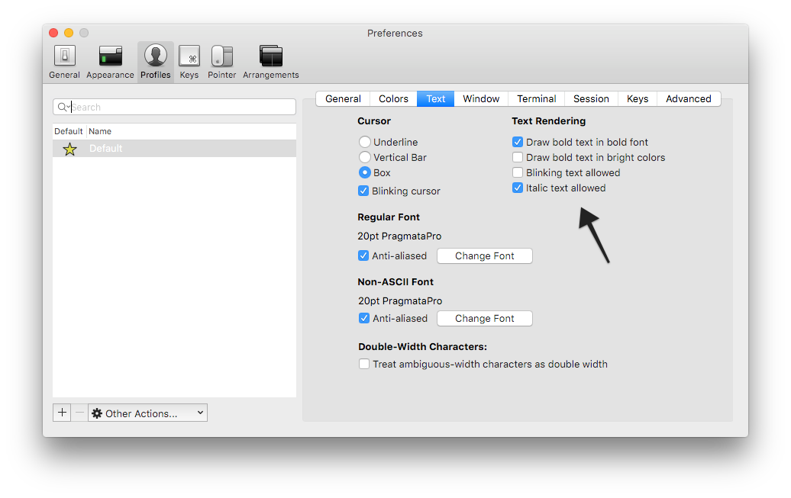
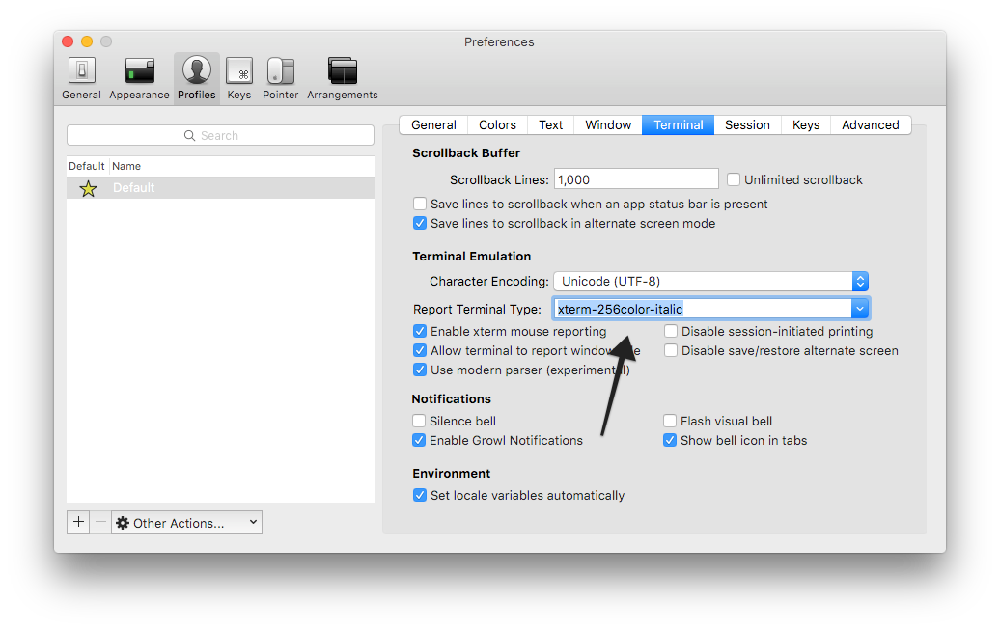

# vimfiles

> My Vim setup.

<a href="https://dribbble.com/shots/1435854-Vim-Replacement-Icon"></a>

## Install

```sh
$ git clone --recursive git@github.com:rafaelrinaldi/vimfiles.git
$ cd vimfiles
$ ./install
```

## Setup

* Before doing anything it will create a backup at `/tmp/vim_backup` so you can restore from there if needed
* You have the option to use :sparkles: [Neovim](http://neovim.org) :dizzy: instead of Vim (it'll take care of making it work properly)
* If [Homebrew](http://brew.sh) is available, will try to update the editor to its latest version
* Uses [Vundle](https://github.com/VundleVim/Vundle.vim) to manage plugins (including Vundle itself)
* Automatically download and installs Vundle plugins
* Read color scheme from the user after installing all plugins (default is `solarized`)
* Supports GUIs making all visual configuration look consistent

## Enabling italic in iTerm2 and Vim

* Copy the [`xterm-256color-italic.terminfo`](/xterm-256color-italic.terminfo) file to your `$HOME`
* Make sure you have italics enabled in iTerm2:

* Process the file with `tic`:
```sh
$ tic $HOME/xterm-256color-italic.terminfo
```
* Report new terminal type in iTerm2:

* Make sure you export your `$TERM` properly. In [Fish](http://fishshell.com):
```fish
set -g TERM xterm-256color-italic
```
* If everything went well:
```sh
$ echo $TERM
xterm-256color-italic
```
* Now tell Vim how to render comments in italic:
```viml
" Make sure to add this after your theme setup
highlight Comment cterm=italic
```

Mad props to @alexpearce for the tip.

## Options

### `--no-symbols`

Do not add symbols to install the output.

## License

MIT © [Rafael Rinaldi](http://rinaldi.io)
